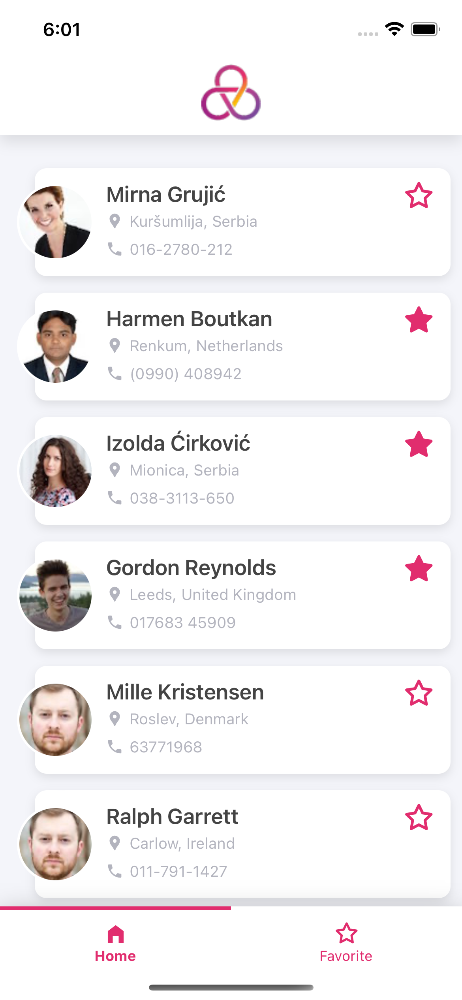

# React Native Test

Screens
- Login screen.
- Dashboard screen with bottom navigation:
    - There will be 2 tabs inside it:
        - Home
        - Favorite
        
Login Screen
- There will be three views.
    - Enter Email (Input Field)
    - Enter Password (Input Field)
    - Login (Button)
- Login button click → check the user input and allow login with the fixed email & password below.
- If email & password matched, open the dashboard screen with two tabs. (Email: reactnative@jetdevs.com , Password: jetdevs@123 )

Home Tab
- Random user API, load more (pagination), and pull to refresh.
- The following items should be in each item.
    - Profile picture
    - Name
    - Other details (optional, you can add them to make better UI)
    - Your favorite icon on the top right side.
- Provide a function to mark users as a favorite/unfavorite.
Favorite Tab
- Show your favorite users list.
- Provide an option to mark users as an unfavorite.

Technical Specifications
- Redux
- React hooks
- Random user API call: https://randomuser.me/api/?results=10
- For more details: https://randomuser.me
- All code should be written in Typescript
## Documentation

> Clone repository
```sh
clone https://github.com/nikul-tatva/jetDevsRNTest.git
```
> Install Dependencies
```sh
yarn install
```
> Install Pods
```sh
cd ios
pod install
```
> Run App in android
```sh
npx react-native run android
```
> Run App in ios
```sh
npx react-native run ios
```
## Screenshots
    
     
## Authors

- [@nikul-tatva](http://github.com/nikul-tatva/)
